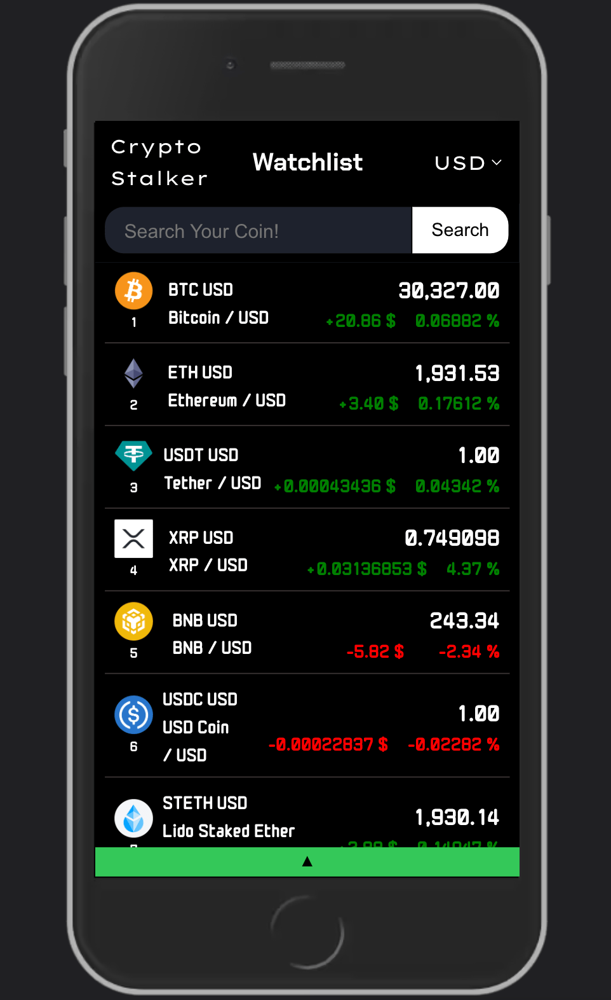
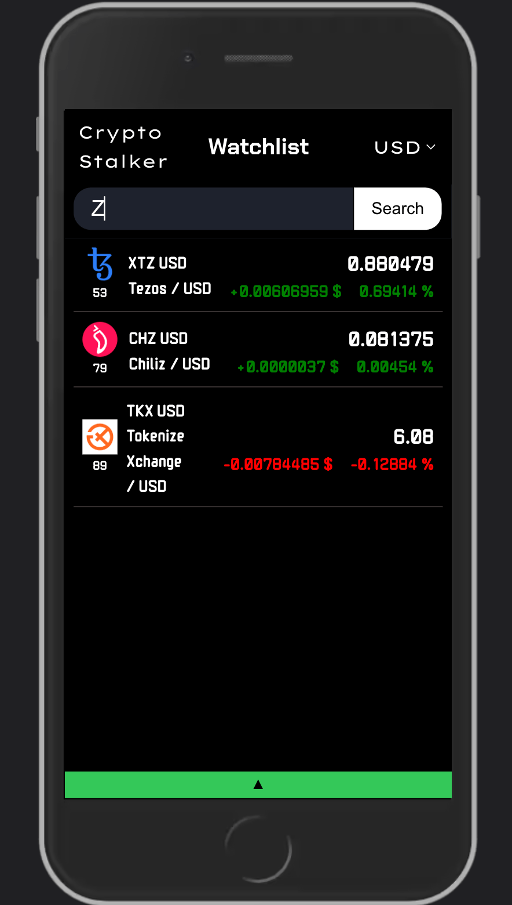
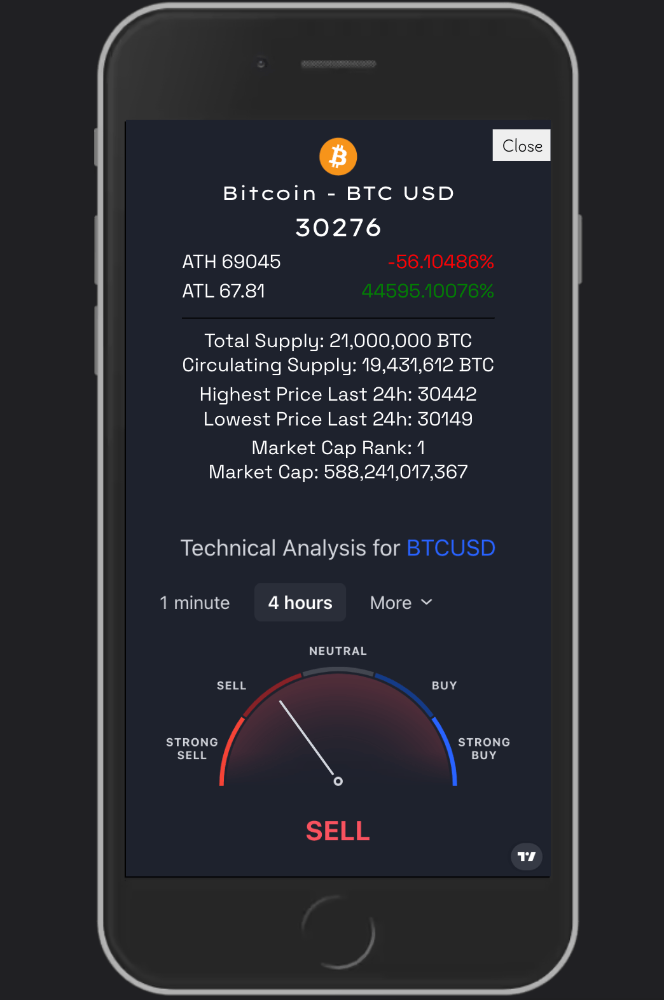

# Crypto Stalker

Crypto Stalker is a web application that provides real-time data on the first 100 cryptocurrencies sorted by market cap. It fetches data from the CoinGecko API and displays it in a user-friendly format. Users can view details such as the current price, market cap, and price changes of different cryptocurrencies.

## Screenshots

# Links
- [Live Version](https://crypto-stalker-web.netlify.app)
- [Source Code](https://github.com/fa125had/Crypto-Stalker)

## Features

- Real-time data: The application fetches data from the CoinGecko API every minute to ensure the data displayed is up-to-date.
- Detailed information: Clicking on a cryptocurrency displays more detailed information about it.
- Search functionality: Users can search for a specific cryptocurrency using the search bar.
- Error handling: The application handles errors gracefully and informs the user when something goes wrong.

## Technologies Used

- JavaScript: The application is entirely written in JavaScript.
- HTML/CSS: Used for structuring and styling the application.
- CoinGecko API: Used to fetch real-time data about cryptocurrencies.

## Code Principles and Patterns

This application was developed with several key software development principles and patterns in mind:

1. **Don't Repeat Yourself (DRY)**: The codebase is designed to avoid repetition. Functions and modules are reused wherever possible, making the code more maintainable and easier to update.
2. **Separation of Concerns (SOC)**: Each module in the application has a clear, distinct responsibility. This separation makes the code easier to understand, test, and maintain.
3. **Model-View-Controller (MVC)**: The application follows the MVC pattern. The model interacts with the API and manages the data, the view is responsible for the user interface, and the controller mediates the data flow in the application.
4. **Asynchronous JavaScript**: The application makes extensive use of asynchronous JavaScript (`async/await`) to handle API calls. This ensures that the application remains responsive and doesn't block the main thread while waiting for API responses.

## Additional Code Principles and Patterns

In addition to the principles and patterns mentioned earlier, the application also demonstrates the following:

1. **Modular Design**: The code is organized into modules, each with a specific role, making it easier to understand, test, and maintain.
2. **Use of ES6 Features**: The application makes good use of modern JavaScript (ES6) features such as `import`/`export`, template literals, arrow functions, and `async`/`await`.
3. **CSS Preprocessing (SCSS)**: SCSS, a CSS preprocessor, is used to make the CSS more maintainable and easier to work with.
4. **Responsive Design**: The application is designed to be responsive and looks good on different screen sizes.
5. **Mobile-First Design**: The application follows a "Mobile-First" design approach, ensuring it is accessible and provides a good user experience on mobile devices.
6. **Error Handling**: The JavaScript code includes error handling to improve the overall user experience.
7. **Code Comments**: Comments are used throughout the codebase to explain why certain code decisions were made, making it easier for others to understand the code.

## Application Structure

1. **app.js**: This is the entry point of the application. It initializes the application and calls the necessary functions to fetch and display data.
2. **errorHandler.js**: This module handles any errors that occur during the execution of the application.
3. **contentsModel.js**: This module fetches data from the CoinGecko API and exports functions that return this data.
4. **coingeckoApiModel.js**: This module contains functions that interact with the CoinGecko API. It fetches data from the API, checks the server rate limit, and stores the data in the session storage.
5. **contentsController.js**: This module imports the functions from the contentsModel.js and calls them. It also calls the functions to render the data on the screen.
6. **coingeckoApiController.js**: This module calls the functions from the coingeckoApiModel.js and sets an interval to fetch data every minute.
7. **index.html**: This is the main HTML file. It contains the structure of the application.
8. **style.scss**: This is the main stylesheet for the application. It uses SCSS, a CSS preprocessor, to define styles for the application. The styles are organized according to the components they style. It includes styles for the welcome page, header, search bar, main content, more info container, and footer. It also includes global styles and animations.

## Third-Party Libraries and Widgets

This application makes use of the following third-party libraries and widgets:

- **TradingView Widget**: The application uses the TradingView Widget on the more-info page to provide users with detailed and real-time financial information about the selected cryptocurrency. TradingView is a popular platform that provides real-time information and market insights to millions of traders daily.
- **CoinGecko API**: The application uses the CoinGecko API to fetch real-time data about cryptocurrencies. CoinGecko is a popular platform that provides real-time information and market insights to millions of traders daily.

## How to Run the Application

1. Clone the repository to your local machine.
2. Run `npm install` inside the root directory.
3. Make sure you have a modern browser installed (Chrome, Firefox, Safari, Edge).
4. Open the index.html file in your browser.
5. The application should start, and you should see the list of cryptocurrencies.

## Future Improvements

- Add pagination to the contents view to improve performance when displaying a large number of cryptocurrencies.
- Add the ability to sort cryptocurrencies based on different criteria such as price, market cap, and volume.
- Improve the mobile responsiveness of the application.
- Add more detailed information to the more info view such as the historical price data of the cryptocurrency.

## Contributing

Contributions are welcome! Please feel free to submit a pull request.

## License

This project is licensed under the MIT License.
